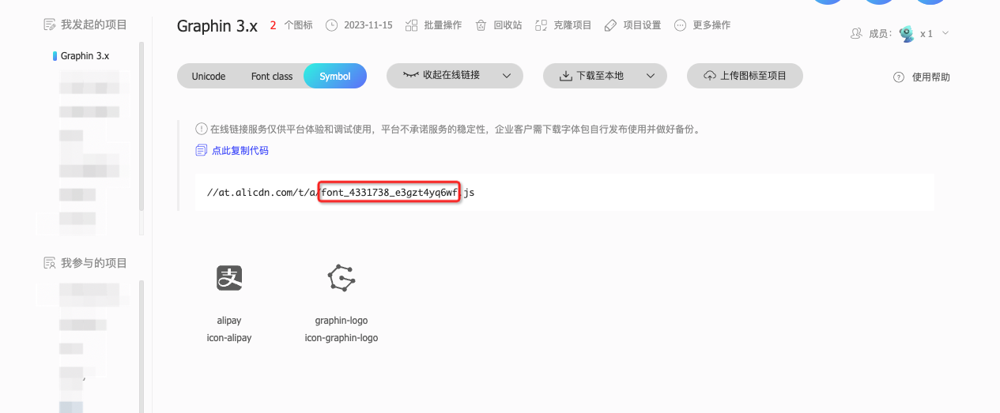

## 基本介绍

从实际业务出发，节点图标（icon or iconShape）能够区分节点的类型，即美观也实用。在开发过程中，语义性表达较好，同时和图片相比，它最大的优势是网络请求少，只需要一次加载字体文件即可.

Graphin 提供了 `registerIconFonts` 工具函数帮助用户低门槛使用

## 从 IconFont 上加载字体图标

该方法入参是一组 [iconfont](https://www.iconfont.cn/) `ID`，这就意味着用户只需要在 iconfont 上收集好图标，将项目 ID 填写进来，该方法将会动态请求 font 字体资源和字体 JSON，然后返回一个 icons，默认的 ids 为 Graphin 官方提供的 ['font_3381398_29c1c449r6f'],即自动请求资源地址`https://at.alicdn.com/t/a/font_3381398_29c1c449r6f.js`

```jsx | pure
import Graphin, { registerIconFonts } from '@antv/graphin';
import React, { useEffect, useState } from 'react';
const fetchData = async () => {
  // registerIconFonts 是异步方法，参数为 fontIconIds []
  const icons = await registerIconFonts();
};
```

<code src='./demos/node-icon.tsx'>

## 自定义字体图标

我们登陆 [iconfont](https://www.iconfont.cn/) 选择自己想要的图标，然后 copy 其项目 ID



<code src='./demos/node-icon-custom.tsx'>
